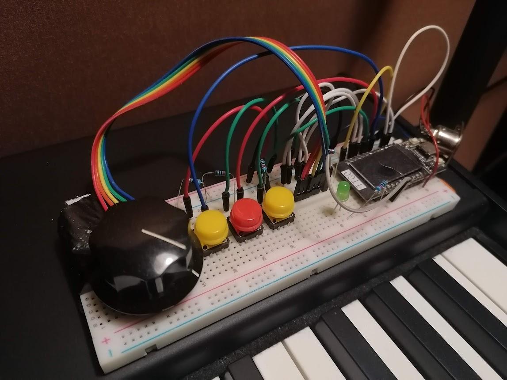

# total-mix

Totalmix Controller

Too poor for the dedicated TotalMix remote and think it looks kinda strange anyway? Now you can enjoy making your own with an ESP32 TTGO T-Display and some extra wires. Guaranteed to work for a year probably. Beautiful isn't it?

Board: ESP32 TTGO T-Display

Pins:

- 22 MIDI DATA
- 37 ENCODER CLK
- 38 ENCODER DT
- 32 SPEAKER
- 33 DIM
- 25 SPEAKER B
